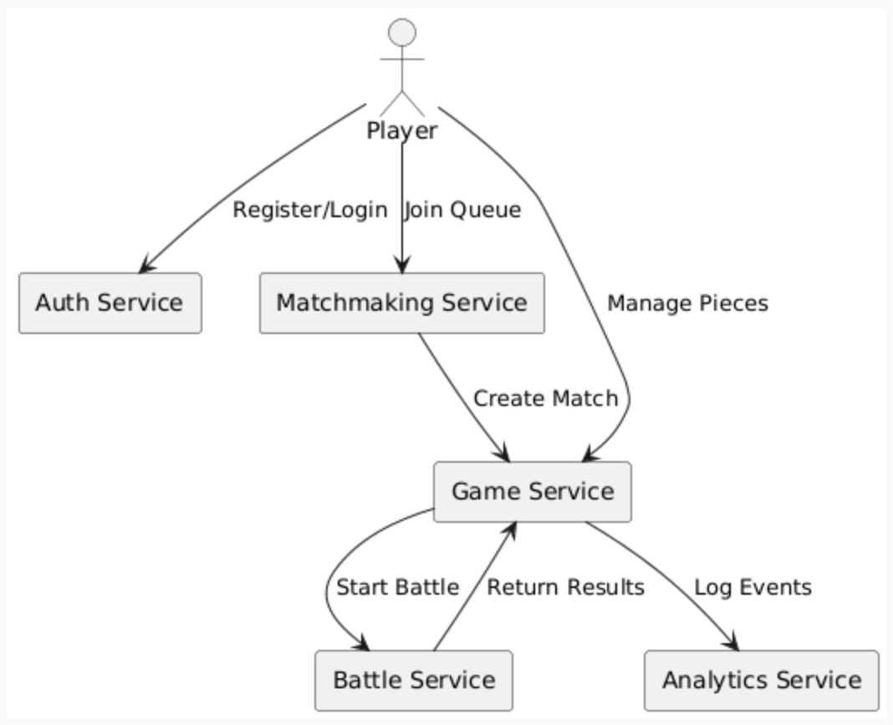

# Features & Requirements

## Epics Overview

| Epic | Description | Stories | Status |
| ---- | ------------| ------- | ------ |
| **E1: Authentication** | Register/login users, issue JWT tokens, protect endpoints | 2 | ✅ |
| **E2: Matchmaking** | Queue players and create matches | 2 | ✅  |
| **E3: Game Management & Shop** | Match state, shop offers, purchases, gold economy, board management, upgrades | 2 | ✅  |
| **E4: Battle Simulation**  | Execute battles automatically and store results | 2 | ✅ |
| **E5: Analytics & monitoring** | Events, leaderboard, live admin metrics (SSE); optional Actuator health | 2 | ✅ |
| **E6: UX** | Figma + implemented React UI | 1 | ✅  |
| **E7: Cloud Deployment & Containerization** | Dockerize and deploy services to Azure | 2 | ✅ |

## User Stories

### Epic 1: Authentication

User identity management and security for all services using JWT.

| ID | User Story | Acceptance Criteria | Priority | Status |
| -- | ---------- | ------------------- | -------- | ------ |
| **US-001** | As a **new player**, I want to **register**, so that I **can access multiplayer features.**  | - Valid email/username/password accepted - Password hashed (BCrypt) - User stored in PostgreSQL - JWT returned on success | Must | ✅ |
| **US-002** | As a **registered player**, I want to **log in**, so that I **can securely use the system.** | - Valid credentials return JWT - Invalid credentials return error - Protected endpoints require JWT | Must | ✅ |

### Epic 2: Matchmaking

| ID | User Story | Acceptance Criteria | Priority | Status |
| -- | ---------- | ------------------- | -------- | ------ |
| **US-003** | As a **player**, I want to **join matchmaking**, so that **I can be matched with an opponent.** | - Authenticated users can join queue - Duplicate queue joins prevented - Queue status retrievable | Must | ✅  |
| **US-004** | As the **matchmaking service**, I want to **create a match** when players are found, so that gameplay can begin. | - Two players are paired - Game Service match created successfully - Match ID returned | Must | ✅ |

### Epic 3: Game Management & Shop

Manages match state, shop offers, economy, board placement and upgrades.

| ID | User Story | Acceptance Criteria | Priority | Status |
| -- | ---------- | --------------------| -------- | ------ |
| **US-005** | As a **player**, I want to **view and purchase pieces**, so that I **can build my team.** | - Shop offers generated per round - Purchase deducts gold - Purchased piece saved to inventory - Match state updated | Must | ✅ |

### Epic 4: Battle Simulation

Runs automated battle and returns outcome.

| ID | User Story | Acceptance Criteria | Priority | Status |
| -- | -----------| ------------------- | -------- | ------ |
| **US-007** | As a **player**, I want the game to  **trigger a battle**, so that **my team fights automatically.** | - Valid match/board state required - Battle result computed - Outcome stored in DB - Game Service receives results | Must | ✅ |

### Epic 5: Analytics & Monitoring

Tracks system and gameplay metrics.

| ID | User Story | Acceptance Criteria | Priority | Status |
| -- | ---------- | ------------------- | -------- | ------ |
| **US-008** | As an **operator**, I want to **see live service/game activity**, so that **demos and health checks are credible.** | - Analytics ingestion path - Admin SSE or snapshot endpoints - Optional `/actuator/health` per service | Must | ✅ |

### Epic 6: UX (Figma + web UI)

| ID | User Story | Acceptance Criteria | Priority | Status |
| -- | ---------- | ------------------- | -------- | ------ |
| **US-009** | As a **player**, I want **usable screens** for auth, queue, shop/board, and battle, so that I **can play without Postman.** | - SPA routes implemented - Figma alignment where applicable | Must | ✅ |

### Epic 7: Cloud Deployment & Containerization

Production-like packaging and deployment.

| ID | User Story | Acceptance Criteria | Priority | Status |
| -- | ---------- | ------------------- | -------- | ------ |
| **US-010** | As a **developer**, I want to **deploy services to Azure**, so that **the system is portable and demonstrable.** | - Dockerfiles for each service - Docker Compose works locally - Services reachable in Azure | Must| ✅ |

## Use Case Diagram

## Non-Functional Requirements

### Performance

Performance here means **player-perceived flow**, not benchmark charts.

- **Readable pacing:** timers and phase changes should be understandable in the UI (shop window, battle reveal), so players always know what phase they are in.
- **Heavy work off the hot path:** battle evaluation runs where it belongs (battle/engine side); the client stays responsive through normal REST usage and intentional refresh cadence.
- **Honest scope:** the project targets smooth behaviour for **course demos and small concurrent use**, not massive concurrency or formal latency SLAs.

### Security

- JWT-based authentication (Bearer token)
- Password hashing using BCrypt
- HTTPS enforced in production (Azure)
- Input validation on all REST endpoints (DTO validation)
- Proper error responses (no sensitive data in error payloads)

### Accessibility

- Responsive layouts in the SPA (desktop / mobile branches where implemented)
- Figma references for structure and iteration
- Audio added

### Reliability

- **Single source of truth:** match and battle outcomes are enforced on the server; clients can refresh without inventing state.
- **When something breaks:** users see **clear errors** (network, auth, match ended) for dev checking instead of silent failure where possible; operators can use **logs**, health endpoints where enabled, and the **admin analytics** view for live checks.
- **Operations model:** one demo environment, manual restarts if needed

### Compatibility

**End users (product):** current **Chrome**, **Safari**, and **Firefox** (latest stable); the game is used as a **web app** in the browser.

| Client | Minimum / notes |
|--------|-----------------|
| **Modern browsers** | Chrome, Safari, or Firefox (latest stable) |
| Postman | Latest *(API testing / development only)* |
| Swagger UI | Included with Springdoc / OpenAPI *(per service in dev)* |
