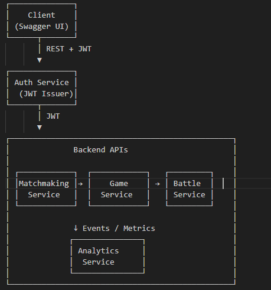

# Criterion: API documentation

## Architecture Decision Record

### Status

**Status:** Accepted  

**Date:** 2026-01-05 

### Context

The project needs **stable HTTP contracts** so behaviour can be understood, graded, and integrated without reading every controller. The backend is split into **multiple Spring Boot services** (auth, matchmaking, game, battle, analytics), each exposing REST endpoints.

Additional forces:

- The **React SPA** (`front-end/`) is the **primary user-facing client**; APIs must match what the UI calls.
- Documentation should stay aligned when endpoints change (prefer generation or a single maintained spec).


### Decision

1. **Per service:** **springdoc-openapi** generates OpenAPI and **Swagger UI** in development (typical paths: `/swagger-ui.html` or `/swagger-ui/index.html` on each service port, e.g. 8081–8084, 8080 for analytics).
2. **Repository contract:** a **unified** OpenAPI **3.1** file — `api-docs/reference/openapi.yaml` in the repo - describes the platform as a whole.
3. **Annotations** on controllers and DTOs (`@Operation`, `@Schema`, validation annotations) feed springdoc; the YAML is the **submitted** reference for swagger endpoints.
4. **Usage:** end users exercise the app in the **browser**; **Swagger/Postman** are for **development, debugging*

### Alternatives Considered

| Alternative | Pros | Cons | Why not chosen |
|-------------|------|------|------------------|
| Manual Markdown only | No tooling | Drifts from code | Rejected as sole source |
| Postman collections only | Fast manual tests | No single schema source in repo | Insufficient as only artefact |
| **springdoc + unified YAML (chosen)** | UI per service + one PDF-friendly spec | Must keep YAML in sync when APIs change | Best fit for microservices + thesis |
| One API Gateway OpenAPI only | Single entry | No gateway module in this repo | Not used |

### Consequences

**Positive:** Clear contracts; 

**Negative:** Two sources (springdoc per service + merged YAML) can drift if only one is updated after a change.

**Neutral:** Production may restrict or protect Swagger UIs; dev remains full access.

## Implementation Details

### Strategy

| Layer | What |
|------|------|
| **Unified spec** | `api-docs/reference/openapi.yaml` — `info`, `servers`, `tags`, `paths`, `components.schemas`, `bearerAuth` |
| **Per service** | `springdoc-openapi-starter-webmvc-ui` in POM; controllers documented with OpenAPI 3 annotations |
| **Client** | TypeScript clients under `front-end/src/api/` call the same path prefixes as in the spec (`/api/auth/...`, etc.) |

### Example (illustrative)

Documented login endpoint and stateless security with Swagger paths permitted (exact `SecurityFilterChain` may vary by service — treat as a pattern, not a copy-paste for every module).

```java
@Operation(summary = "User login",
        description = "Authenticates a user and returns JWT tokens.")
@PostMapping("/login")
public ResponseEntity<AuthResponse> login(@Valid @RequestBody LoginRequest req) {
    return ResponseEntity.ok(auth.login(req));
}
```

### Diagrams



## Requirements Checklist

| # | Requirement | Status | Evidence |
|---|----------------|--------|----------|
| 1 | Endpoints and operations described | ✅  | `openapi.yaml` + springdoc on services |
| 2 | Request/response schemas | ✅  | `components.schemas` in YAML; DTOs in code |
| 3 | Security scheme (JWT) documented | ✅ | `bearerAuth` in unified spec |
| 4 | Discoverable for evaluation | ✅ | File in repo; optional Swagger UI per running service |


**Legend:** ✅ done · ⚠️ verify after changes · ❌ missing

## Known limitations

| Topic | Note |
|--------|------|
| **Swagger in production** | May be disabled or IP-restricted; not required to be public on the internet. |
| **Spec drift** | After changing a controller, update the unified `openapi.yaml` (or your export process) so the thesis stays accurate. |

## References

- [OpenAPI Specification](https://spec.openapis.org/oas/latest.html)
- [springdoc-openapi](https://springdoc.org/)
- [Swagger](https://swagger.io/docs/)
