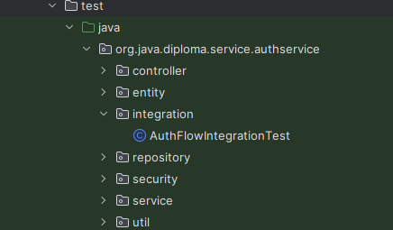

# Criterion: Automated testing

## Architecture Decision Record

### Status

**Status:** Accepted 

**Date:** [2026-01-05]

### Context

Context

The diploma project requires automated testing to demonstrate code correctness, reliability, and maintainability.
Given the microservices-based architecture of AutoChess Classic, the testing strategy needed to address the following constraints:

- Each service must be testable in isolation
- Business logic should be validated independently 
- The project must achieve ≥70% automated test coverage
- The solution should have some CI (github actions)

### Decision

The project uses a layered automated testing strategy based on:
- Unit tests for service-layer business logic
- Mock-based testing for external dependencies
- Selective integration tests for REST controllers
- JUnit 5 + Mockito as the primary testing framework
- JaCoCo for coverage measurement
- Github actions for CI

Each microservice contains their own tests.

### Alternatives Considered

| Alternative             | Pros                     | Cons                                | Why Not Chosen                     |
| ----------------------- | ------------------------ | ----------------------------------- | ---------------------------------- |
| Manual testing only     | Fast to start            | No repeatability, low reliability   | Does not meet the requirements     |

### Consequences

**Positive:**
- Fast and reliable feedback during development
- Clear verification of business logic
- Tests are isolated from infrastructure failures
- Meets the requirements

**Negative:**
- Mocking requires careful setup
- Some issues may not be caught
- Might be challenging if no required knowledge

**Neutral:**
- Integration testing is intentionally limited to core flows only (like auth service controller(login))

## Implementation Details

### Project Structure



### Key Implementation Decisions

| Decision                 | Rationale                           |
| ------------------------ | ------------------------------------|
| Unit-first testing       | Validates core logic independently  |
| Mockito for dependencies | Avoids Redis/DB/network coupling    |
| SecurityContext mocking  | Enables JWT-based logic testing     |
| JaCoCo coverage reports  | Verification of ≥70% coverage       |

### Code Examples

The following code:

- Verifies the authentication login endpoint.
- Ensures that valid credentials return HTTP 200
- and a response containing a JWT access token.

```Java
    @Test
    void login_ok() throws Exception {
        when(authService.login(any()))
                .thenReturn(new AuthResponse("access", "refresh"));

        mockMvc.perform(post("/api/auth/login")
                        .contentType(MediaType.APPLICATION_JSON)
                        .content("""
                    {"identifier":"test","password":"pass"}
                """))
                .andExpect(status().isOk())
                .andExpect(jsonPath("$.accessToken").exists());
    }
```

## Requirements Checklist

| # | Requirement                    | Status | Evidence / Notes            |
| - | ------------------------------ | ------ | --------------------------- |
| 1 | Automated tests implemented    | ✅      | JUnit tests in each service |
| 2 | Business logic covered         | ✅      | Service-layer unit tests    |
| 3 | External dependencies isolated | ✅      | Mockito-based mocking       |
| 4 | ≥70% test coverage             | ✅      | JaCoCo reports              |
| 5 | CI                             | ✅      | Github actions              |

**Legend:**
- ✅ Fully implemented
- ⚠️ Partially implemented
- ❌ Not implemented

## Known Limitations

| Limitation               | Impact                                 | Potential Solution      |
| ------------------------ | -------------------------------------- | ----------------------- |
| Limited end-to-end tests | Some integration bugs may go unnoticed | Add more tests in future|

## References

- JUnit 5 Documentation: https://junit.org/junit5/
- Mockito Documentation: https://site.mockito.org/
- Spring Boot Testing Guide: https://docs.spring.io/spring-boot/docs/current/reference/html/features.html#features.testing
- JaCoCo Documentation: https://www.jacoco.org/jacoco/
