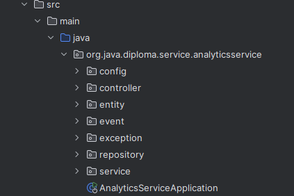

# Criterion: Real-time Analytics

## Architecture Decision Record

### Status

**Status:** Accepted 

**Date:** [2026-01-04]

### Context

The project behavior and gameplay events should be monitored during execution of the app.
AutoChess Classic consists of multiple microservices, which have the following constraints:

- Analytics data is generated across several services
- Metrics must be accessible without a fronten
- Analytics must not impact gameplay performance
- The solution must be simple
- Real-time visibility is required for matchmaking, gameplay, and service health

### Decision

Real-time analytics is implemented using Spring Boot Actuator across all microservices, combined with Redis for fast event aggregation and an Analytics Service for collecting both long term data and real time. Each service publishes lightweight metrics.
High-frequency events (queue joins, board updates, battle events) are tracked in Redis, while the data is periodically persisted to PostgreSQL by the Analytics Service and shown on a real-time dashboard. Metrics are exposed as JSON via REST endpoints, enabling real-time inspection using a browser, Swagger UI, or Postman.

### Alternatives Considered

| Alternative                                      | Pros                                   | Cons                                | Why Not Chosen                         |
| ------------------------------------------------ | -------------------------------------- | ----------------------------------- | -------------------------------------- |
| External monitoring tools (e.g Prometheus )      | Powerful dashboards, industry standard | Complex setup, hard to manage       | Too heavy for this project             |
| Log-based analytics only                         | Very simple                            | Not real-time                       | Does not satisfy real-time requirement |


### Consequences

**Positive:**
- Real-time insight into system behavior
- Minimal performance overhead
- Analytics works across multpiple services
- Easy inspection through standard HTTP endpoints

**Negative:**
- Not very complext
- Very simple ui

**Neutral:**
- Metrics are primarily developer used for developer to see analytics, not much related to the user

## Implementation Details

### Project Structure



### Key Implementation Decisions

| Decision                          | Rationale                              |
| --------------------------------- | -------------------------------------- |
| Actuator for system metrics       | Built-in, standardized monitoring      |
| Micrometer for custom metrics     | Simple integration and low overhead    |
| Redis for real-time event storage | Fast access for high-frequency updates |
| Separate Analytics Service        | Decouples analytics from core gameplay |
| REST-based metrics exposure       | No frontend required                   |
| A real-time dashboard             | Shows all the redis metrics            |

### Code Examples

```Java
    // Exposes real-time analytics metrics via REST for clients
    // and supports WebSocket-based dashboards for push updates.
    // This allows both lightweight inspection (Swagger/Postman)
    // and live UI updates.
    @GetMapping
    public Map<String, Object> getLiveMetrics() {
        Map<String, Object> metrics = new HashMap<>();

        Object queueSize = redisTemplate.opsForValue().get("analytics:current_queue_size");
        metrics.put("currentQueueSize", queueSize != null ? queueSize : 0);

        Object totalJoins = redisTemplate.opsForValue().get("analytics:total_queue_joins");
        metrics.put("totalQueueJoins", totalJoins != null ? totalJoins : 0);

        Long eventsLastMinute = redisTemplate.opsForZSet().zCard("analytics:events:last_minute");
        metrics.put("eventsLastMinute", eventsLastMinute != null ? eventsLastMinute : 0);

        Object lastUpdated = redisTemplate.opsForValue().get("analytics:last_updated");
        metrics.put("lastUpdated", lastUpdated);

        Object playerJoins = redisTemplate.opsForValue().get("analytics:event_type:player_join");
        Object playerLeaves = redisTemplate.opsForValue().get("analytics:event_type:player_leave");

        Map<String, Object> eventsByType = new HashMap<>();
        eventsByType.put("player_join", playerJoins != null ? playerJoins : 0);
        eventsByType.put("player_leave", playerLeaves != null ? playerLeaves : 0);
        metrics.put("eventsByType", eventsByType);

        return metrics;
    }
```

## Requirements Checklist

| # | Requirement                  | Status | Evidence/Notes                          |
| - | ---------------------------- | ------ | --------------------------------------- |
| 1 | Real-time metrics collection | ✅      | Micrometer counters and Redis storage   |
| 2 | Cross-service analytics      | ✅      | Metrics generated in all microservices  |
| 3 | Live metric access           | ✅      | Actuator + custom REST endpoints        |
| 4 | Persistent analytics storage | ✅      | Aggregated metrics stored in PostgreSQL |
| 5 | Persistent analytics storage | ⚠️      | Real time dashboards                    |


**Legend:**
- ✅ Fully implemented
- ⚠️ Partially implemented
- ❌ Not implemented

## Known Limitations

| Limitation               | Impact                  | Potential Solution               |
| ------------------------ | ----------------------- | -------------------------------- |
| Simple dashboard         | Harder to read metrics  | Add a more professional dashboard|
| Redis data volatility    | Data lost on restart    | Acceptable for real-time metrics |
| Manual metric inspection | No alerts or automation | Add alerting tools               |


## References

📘 Spring Boot Actuator Documentation

- Spring Boot Actuator  (https://docs.spring.io/spring-boot/reference/actuator/index.html)
- Actuator metrics (https://docs.spring.io/spring-boot/reference/actuator/metrics.html)
- Actuator endpoints overview (https://docs.spring.io/spring-boot/reference/actuator/endpoints.html)
- Micrometer documentation (https://micrometer.io/docs/)
- Redis documentation (https://redis.io/docs/latest/)
