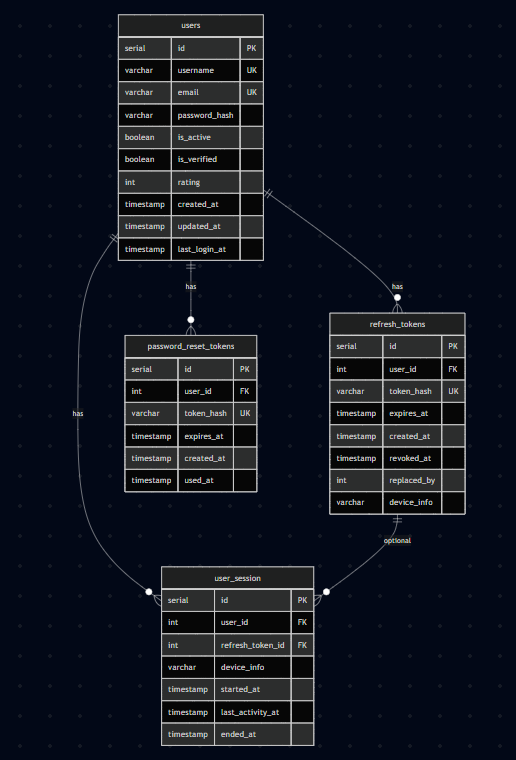
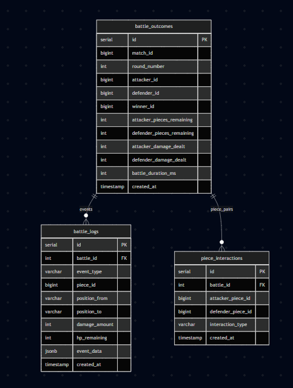
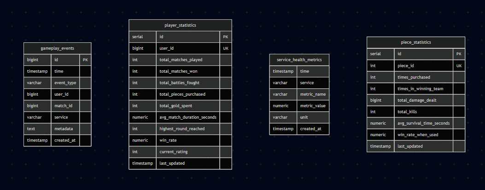
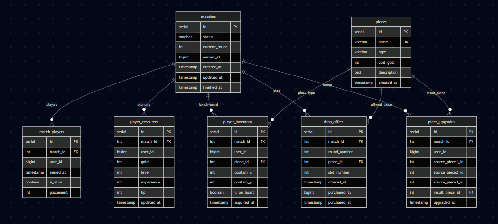
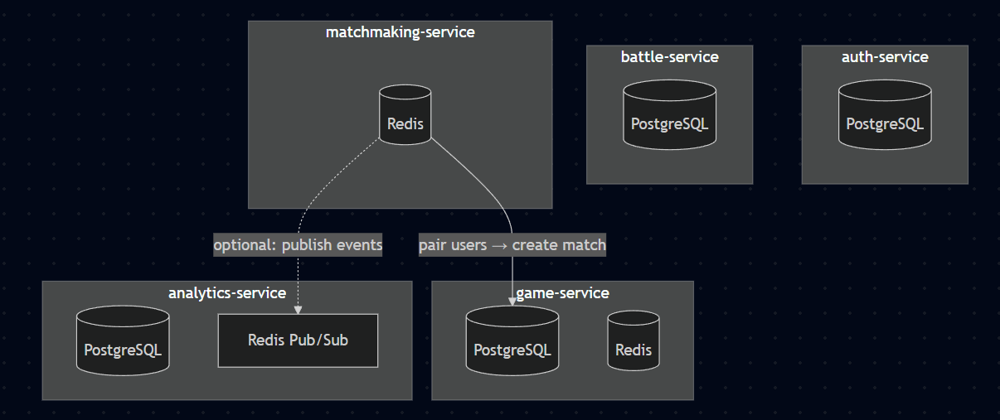

# Criterion: Database

## Architecture Decision Record

### Status

**Status:** Accepted  

**Date:** 2026-05-01 

### Context

The project requires a properly designed and implemented database layer demonstrating persistence, schema design, and correct integration with application logic.

AutoChess Classic uses a microservices architecture, which introduces the following constraints:

- Each service must be independently deployable and scalable.
- Services should not share database schemas, to avoid tight coupling.
- Game-related data includes both long-term persistent data (users, matches, history) and short-lived, high-frequency state (queues, board snapshots).
- Performance matters for matchmaking and hot game state.
- The stack uses **PostgreSQL** for durable storage and **Redis** as an in-memory layer (queues, cache-like structures, Pub/Sub).

### Decision

A **database-per-service** pattern was chosen, using **PostgreSQL** for persistent storage and **Redis** where low latency or ephemeral structures are required.

Each microservice that owns relational data manages its own schema (typically via **Flyway** migrations). Redis holds volatile structures such as the matchmaking queue, transient game state keyed by match id, and analytics event fan-in.

### Alternatives Considered

| Alternative | Pros | Cons | Why not chosen |
|-------------|------|------|----------------|
| Single shared database | Simple to implement | Poor scalability; breaks service isolation | Violates bounded contexts |
| NoSQL (e.g. MongoDB) | Flexible schema | Less natural fit for relational integrity in this domain | PostgreSQL matches structured match/user data |
| In-memory only | Very fast | Data loss on restart; no audit trail | Persistence is mandatory |

### Consequences

**Positive:**

- Clear data ownership per service.
- Improved scalability boundary per datastore.
- Clean split between durable rows (PostgreSQL) and transient keys/channels (Redis).
- Easier to reason about failures per service.

**Negative:**

- More code and configuration to maintain than a single database.
- Deployment requires wiring multiple datasources and Redis.

**Neutral:**

- Some derived or duplicated facts across services are accepted as a trade-off for decoupling.

## Implementation Details

### Database design overview

Table lists reflect **Flyway migrations** and/or **JPA entities** in the monorepo; Redis keys reflect implemented constants (exact prefixes may evolve).

#### Auth-service

**PostgreSQL**

- `users`
- `refresh_tokens`
- `password_reset_tokens`
- `user_session`

#### Game-service

**PostgreSQL**

- `matches`
- `match_players`
- `pieces`
- `player_inventory`
- `player_resources`
- `shop_offers`
- `piece_upgrades`

**Redis** (examples)

- `game:board:{matchId}` — board matrix / compact representation for fast reads.
- `game:state:{matchId}` — ephemeral phase/round and related shop/board coordination state.

#### Battle-service

**PostgreSQL**

- `battle_outcomes`
- `battle_logs`
- `piece_interactions`

#### Matchmaking-service


**Redis**

- `matchmaking:queue` — FIFO list of user ids waiting to play.
- `matchmaking:assigned:{userId}` — assigned match id with TTL (cleared when stale).


#### Analytics-service

**PostgreSQL**

- `gameplay_events`
- `player_statistics`
- `service_health_metrics`
- `piece_statistics`

**Redis**

- Pub/Sub channel **`analytics:events`** — matchmaking and other producers publish JSON events; `RedisSubscriber` ingests them into persistence and realtime admin metrics.

### Key implementation decisions

| Decision | Rationale |
|----------|-----------|
| Database-per-service | Prevents tight coupling between microservices |
| PostgreSQL for persistence | Strong consistency and relational integrity |
| Redis for queues, game hot state, analytics ingestion | Low-latency updates and Pub/Sub fan-in |
| JPA/Hibernate where used | Reduces boilerplate for CRUD paths |
| Flyway migrations | Versioned schema changes across environments |

### Code examples

Example of Spring Data JPA usage (illustration from `analytics-service`):

```java
@Repository
public interface GameplayEventRepository extends JpaRepository<GameplayEvent, Long> {

    List<GameplayEvent> findByUserIdOrderByTimeDesc(Long userId);
}
```

Example Flyway migration (analytics-service):

```sql
CREATE TABLE gameplay_events (
    id BIGSERIAL PRIMARY KEY,
    time TIMESTAMP NOT NULL,
    event_type VARCHAR(50) NOT NULL,
    user_id BIGINT,
    match_id BIGINT,
    service VARCHAR(50) NOT NULL,
    metadata TEXT,
    created_at TIMESTAMP NOT NULL DEFAULT CURRENT_TIMESTAMP
);
```

### Diagrams


**Rendered figures** (under [`docs/assets/diagrams/`](../../assets/diagrams/); click an image to open the PNG):

[](../../assets/diagrams/auth.png)

[](../../assets/diagrams/battle.png)

[](../../assets/diagrams/analytics.png)

[](../../assets/diagrams/game.png)

[](../../assets/diagrams/all-services.png)


## Requirements checklist

| # | Requirement | Status | Evidence / notes |
|---|-------------|--------|------------------|
| 1 | Persistent storage | ✅ | PostgreSQL per owning service + Flyway |
| 2 | Proper schema design | ✅ | Migrations + ER diagrams in assets |
| 3 | Integration with backend logic | ✅ | Repositories/services use owned tables |
| 4 | Redis for real-time / ephemeral data | ✅ | Matchmaking queue; game `game:*` keys; analytics `analytics:events` |

**Legend**

- ✅ Fully implemented  
- ⚠️ Partially implemented  
- ❌ Not implemented  

## Known limitations

| Limitation | Impact | Potential mitigation |
|------------|--------|----------------------|
| Multiple databases increase setup complexity | Harder first-time local setup | `docker-compose` and documented env vars |
| Redis data is volatile | Loss on restart for transient keys | Expected for queue/board snapshots; Postgres holds durable facts |

## References

- [Flyway](https://www.red-gate.com/products/flyway/community/)
- [PostgreSQL documentation](https://www.postgresql.org/docs/)
- [Redis documentation](https://redis.io/docs/)
- OpenAPI: `api-docs/reference/openapi.yaml` in the repo  
- [Project repositories (GitHub org)](https://github.com/orgs/diploma-sdc-2025/repositories)  
