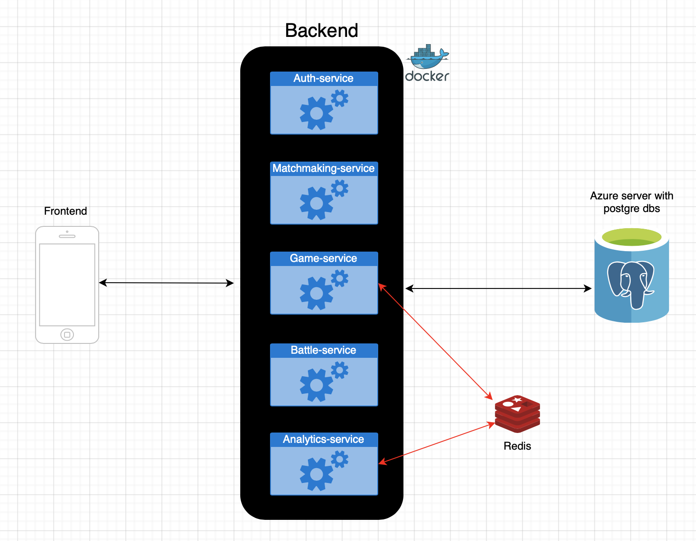

# 2. Technical Implementation

This section covers architecture, design decisions, and implementation details.

## Contents

- [Tech Stack](tech-stack.md)
- [Criteria](criteria/) — one page per evaluation criterion
- [Deployment](deployment.md)

## Solution Architecture

### High-Level Architecture

### System Components

| Component | Description | Technology |
| --------- | ----------- | ---------- |
| **SPA** | Browser client: queue, shop/board, battle UI | React, TypeScript, Vite |
| **Auth Service** | Registration, login, JWT, user/rating integration | Spring Boot, PostgreSQL |
| **Matchmaking Service** | Redis-backed queue, pairing, calls Game Service | Spring Boot |
| **Game Service** | Match lifecycle, shop, inventory, battle orchestration | Spring Boot, Redis, PostgreSQL |
| **Battle Service** | Stockfish evaluation, battle outcomes | Spring Boot |
| **Analytics Service** | Events, leaderboard, Redis ingestion, **SSE** admin stream | Spring Boot, PostgreSQL, Redis |
| **Reverse proxy** | TLS, SPA or Vite upstream, `/api/*` routing | nginx |

### Data Flow (summary)

1. Player uses SPA → REST to Auth / Matchmaking / Game / Battle / Analytics as needed.
2. Game Service persists authoritative match state; Battle Service runs Stockfish.
3. Analytics consumes Redis channel events and exposes REST + **SSE** for operators.

## Key Technical Decisions

| Decision | Rationale |
| -------- | --------- |
| Multiple Spring Boot services | Separation of auth, queue, game logic, engine CPU, analytics |
| REST + selective polling (client) | Phased gameplay does not require WebSockets for every interaction |
| SSE for admin analytics | Server→browser push without full WebSocket infrastructure |
| PostgreSQL + Flyway | Repeatable schemas per service |
| Redis | Queue, caches, analytics pub/sub |
| OpenAPI | Contract for SPA and graders |

## Security Overview

| Aspect | Implementation |
|--------|----------------|
| **Authentication** | JWT Bearer; shared signing secret across validating services |
| **Authorization** | Protected routes per service; admin tokens for analytics dashboards |
| **Transport** | HTTPS in production (nginx) |
| **Secrets** | Environment variables — never commit production secrets |
